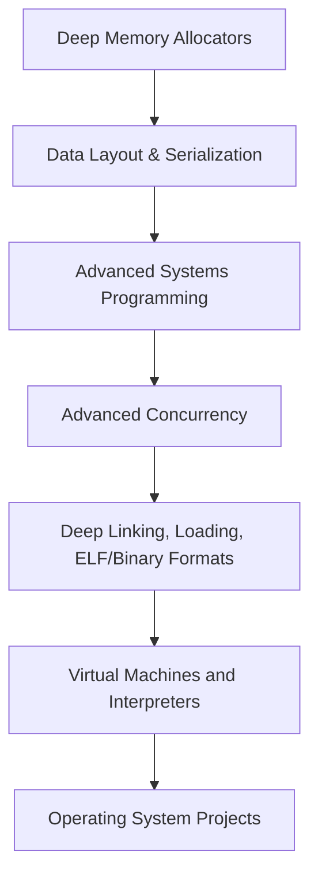

```mermaid
flowchart TD
  A(Continuous Integration / Continuous Deployment - CI/CD) --> A1(Learn CI Concepts)
  A --> A2(Learn CD Concepts)
  A --> A3(Practice with Jenkins, GitHub Actions)

  B(Infrastructure as Code - IaC) --> B1(Learn IaC Concepts)
  B --> B2(Practice Terraform Basics)

  C(Configuration Management) --> C1(Learn Ansible Basics)

  D(Container Orchestration) --> D1(Learn Kubernetes Basics)
  D --> D2(Understand Helm)

  E(Cloud Services) --> E1(Learn AWS Core Services - EC2, S3, IAM)

  F(Monitoring and Logging) --> F1(Setup Prometheus and Grafana)
  F --> F2(Understand ELK Stack)

  G(Security in DevOps) --> G1(Learn Secrets Management)
  G --> G2(Understand CI/CD Pipeline Security)
  G --> G3(Learn Container Security Practices)
```

_Nucleo's Low-Level Learning Plan — v1.0_
# 🧠 Low-Level Programming Mastery Map (Post-CS:APP)

This roadmap focuses on deepening practical low-level programming skills after completing *Computer Systems: A Programmer's Perspective (CS:APP)*.

---

## ✅ Checklist

- [x] Completed *Computer Systems: A Programmer's Perspective (CS:APP)*

---

## 🚀 Mastery Flowchart

### Resources

| Step | Broad Topic | Free Book / Resource |
|:---|:---|:---|
| 1 | **Deep Memory Allocators** | [Modern Operating Systems (Ch 2)](https://cs.brown.edu/courses/cs161/papers/tanenbaum-memory.pdf) |
| 2 | **Manual Data Layout & Serialization** | [Zig Learn (Structs and Memory)](https://ziglearn.org/) |
| 3 | **Advanced Systems Programming** | [Beej's Guide to Network Programming](https://beej.us/guide/bgnet/) |
| 4 | **Advanced Concurrency (Lock-Free)** | [OSTEP (Concurrency Advanced)](https://pages.cs.wisc.edu/~remzi/OSTEP/) |
| 5 | **Deep Linking, Loading, ELF/Binary Formats** | [Linkers and Loaders (Free Draft)](https://www.iecc.com/linker/linker.pdf) |
| 6 | **Virtual Machines and Interpreters** | [Build Your Own Lisp](http://www.buildyourownlisp.com/) |
| 7 | **Operating System Projects** | [The Little Book About OS Development](https://littleosbook.github.io/) |

---

## ✨ Real Project Ideas

| Phase | Project |
|:---|:---|
| Deep Memory | Implement a slab allocator in Zig. |
| Data Layout | Serialize/deserialize a Zig struct manually to a file. |
| Systems | Write a TCP echo server using raw syscalls (no stdlib). |
| Concurrency | Implement a lock-free ring buffer (FIFO queue) in Zig. |
| Linking/Binaries | Write a parser that reads and prints ELF section names. |
| VM | Create a bytecode interpreter for math expressions (`3 + 5 * 2`). |
| OS | Write a bootloader that prints text, then a kernel that changes colors. |

# Backend Development

```mermaid
flowchart TD
  A(Server and Application Logic) --> A1(gRPC APIs)
  A --> A2(WebSocket APIs)
  A --> A3(GraphQL APIs)
  A --> A4(Business Logic)
  
  B(Database Management) --> B1(Database Design and Modeling)
  B --> B2(Advanced SQL)

  C(Security) --> C1(Data Protection - Encryption)
  C --> C2(Input Validation and Sanitization)
  C --> C3(Access Control - RBAC)
  C --> C4(Compliance - GDPR, HIPAA)

  D(Performance Optimization) --> D1(Caching Strategies)
  D --> D2(Load Balancing Concepts)
  D --> D3(Database Indexing & Query Optimization)
  D --> D4(Code and API Optimization)

  E(Communication with Other Services) --> E1(Microservices Architecture)
  E --> E2(Message Queues - RabbitMQ, Kafka)
  E --> E3(Third-party Integrations - APIs)
```

---

## 📚 Resources (Mostly Free)

| Topic | Free Resources |
|:---|:---|
| **gRPC APIs** | - [gRPC Basics - Google Codelabs](https://grpc.io/docs/what-is-grpc/introduction/)   - [Practical gRPC (Book Free Online)](https://www.oreilly.com/library/view/practical-grpc/9781492058328/) |
| **WebSocket APIs** | - [WebSockets - MDN](https://developer.mozilla.org/en-US/docs/Web/API/WebSockets_API)   - [WebSocket Tutorial - FreeCodeCamp](https://www.freecodecamp.org/news/websockets-tutorial/) |
| **GraphQL APIs** | - [How to GraphQL - Free Fullstack Tutorial](https://www.howtographql.com/) |
| **Business Logic & Domain-driven design** | - [Domain-Driven Design Quickly (Free Book PDF)](https://www.infoq.com/minibooks/domain-driven-design-quickly/) |
| **Database Design & Modeling** | - [Database Design - Stanford Online Course](https://lagunita.stanford.edu/courses/DB/2014/SelfPaced/about) |
| **Advanced SQL** | - [Mode Analytics SQL Tutorial](https://mode.com/sql-tutorial/)   - [LeetCode SQL Problems (Free practice)](https://leetcode.com/problemset/database/) |
| **Security** | - [OWASP Top 10 (must-read free)](https://owasp.org/www-project-top-ten/) |
| **Caching & Performance** | - [Designing Data-Intensive Applications (Chapter 11 - Caching is free)](https://dataintensive.net/) |
| **Microservices, Message Queues** | - [Microservices Fundamentals - Microsoft Free Book](https://learn.microsoft.com/en-us/dotnet/architecture/microservices/) |
| **RabbitMQ/Kafka Basics** | - [RabbitMQ Tutorials - Official](https://www.rabbitmq.com/getstarted.html)   - [Kafka 101 - Confluent Free Course](https://developer.confluent.io/learn/kafka-fundamentals/) |

---

## 🛠️ Small Projects To Solidify Each

| Topic | Mini-Project |
|:---|:---|
| **gRPC APIs** | Build a *simple chat service* using gRPC (text messages between users) |
| **WebSocket APIs** | Create a *live collaborative text editor* (like Google Docs basic) |
| **GraphQL APIs** | Build a *blog app* with GraphQL queries/mutations |
| **Business Logic** | Make a *shopping cart system* with discount rules |
| **Database Design** | Design a *library system* (Books, Authors, Users, Loans) |
| **Advanced SQL** | Build a *report generation system* (e.g., Monthly active users, Total orders) |
| **Security** | Make a *login system* with encrypted passwords and role-based access |
| **Performance Optimization** | Add *Redis caching* to an API and measure before/after response times |
| **Microservices** | Create two microservices: *User Service* and *Order Service* communicating via events |
| **Message Queues** | Simulate *order processing* with RabbitMQ (order queued and processed asynchronously) |
| **Third-party Integrations** | Integrate *Stripe payment API* in a mock store |

---

## 🚀 Suggested Learning Path (Optional)

1. **Database Design and Advanced SQL**  
   \- Learn design first → then SQL queries → then transactions.

2. **Server and Application Logic (gRPC, WS, GraphQL)**  
   \- Build APIs after mastering database.

3. **Security Basics**  
   \- Learn input validation, encryption, and access control.

4. **Performance Optimization**  
   \- Add caching, optimize queries, learn how load balancing works.

# 📊 DevOps

---

## 📚 Resources (Free / Mostly Free)

| Topic | Free Resources |
|:---|:---|
| **CI/CD** | - [CI/CD Pipeline with Jenkins - FreeCodeCamp](https://www.freecodecamp.org/news/jenkins-ci-cd-pipeline-tutorial/)   - [GitHub Actions Documentation](https://docs.github.com/en/actions) |
| **Infrastructure as Code (IaC)** | - [Learn Terraform - HashiCorp Free Tutorials](https://developer.hashicorp.com/terraform/tutorials) |
| **Configuration Management (Ansible)** | - [Ansible for Absolute Beginners - KodeKloud](https://kodekloud.com/courses/ansible-basics/) (Free trial available)   - [Ansible Documentation](https://docs.ansible.com/ansible/latest/index.html) |
| **Container Orchestration (Kubernetes, Helm)** | - [Kubernetes Official Docs - Learn Basics](https://kubernetes.io/docs/tutorials/kubernetes-basics/)   - [Helm Official Documentation](https://helm.sh/docs/) |
| **Cloud Services (AWS Basics)** | - [AWS Free Tier + AWS Educate (Free Courses)](https://aws.amazon.com/training/awseducate/)   - [AWS EC2, S3, IAM - FreeCodeCamp](https://www.freecodecamp.org/news/aws-certification-cloud-practitioner-study-guide/) |
| **Monitoring and Logging** | - [Prometheus and Grafana Free Tutorials - Prometheus Docs](https://prometheus.io/docs/introduction/overview/)   - [ELK Stack Overview - Elastic Docs](https://www.elastic.co/what-is/elk-stack) |
| **Security in DevOps** | - [Vault by HashiCorp - Learn Vault (Official)](https://developer.hashicorp.com/vault/docs)   - [CI/CD Security Basics - OWASP Cheat Sheet](https://cheatsheetseries.owasp.org/cheatsheets/CI_CD_Security_Cheat_Sheet.html) |

---

## 🛠️ Small Projects To Solidify Each

| Topic | Mini-Project |
|:---|:---|
| **CI/CD** | Setup Jenkins pipelines for automatic testing and deployment of a simple Node.js app |
| **Infrastructure as Code (IaC)** | Write Terraform scripts to provision an EC2 instance with a web server |
| **Configuration Management (Ansible)** | Use Ansible to configure a server with NGINX and firewall rules |
| **Container Orchestration (Kubernetes, Helm)** | Deploy a basic web app (e.g., Todo app) to Kubernetes using Helm charts |
| **Cloud Services (AWS Basics)** | Host a static website on S3 with a custom domain (optional: Add IAM user permissions) |
| **Monitoring and Logging** | Setup Prometheus + Grafana to monitor a dummy server (basic CPU/memory metrics) |
| **Security in DevOps** | Integrate Vault for secret storage in a simple CI/CD pipeline (like API keys during deployment) |

---

# 🚀 Suggested Learning Order

1. **Start with CI/CD** → Understand how builds/deployments are automated.
2. **Learn Infrastructure as Code (Terraform)** → Automate cloud resource creation.
3. **Learn Configuration Management (Ansible)** → Manage server setup easily.
4. **Learn Container Orchestration (Kubernetes + Helm)** → Manage and scale apps.
5. **Understand Cloud Services (AWS basics)** → Host, store, and manage resources.
6. **Learn Monitoring and Logging (Prometheus, ELK)** → Track performance and find issues.
7. **End with Security Practices** → Secure your deployments and secrets.
5. **Communication with Other Services**  
   \- Learn microservices, queues, and integrate third-party services.

