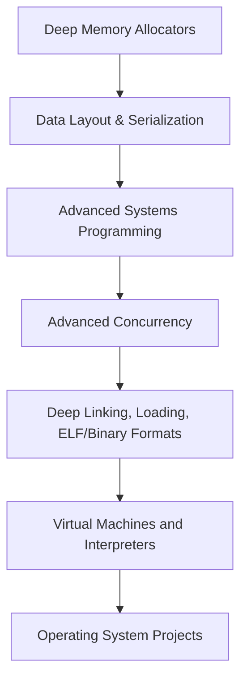

_Nucleo's Low-Level Learning Plan — v1.0_
# 🧠 Low-Level Programming Mastery Map (Post-CS:APP)

This roadmap focuses on deepening practical low-level programming skills after completing *Computer Systems: A Programmer's Perspective (CS:APP)*.

---

## ✅ Checklist

- [x] Completed *Computer Systems: A Programmer's Perspective (CS:APP)*

---

## 🚀 Mastery Flowchart

### Resources

| Step | Broad Topic | Free Book / Resource |
|:---|:---|:---|
| 1 | **Deep Memory Allocators** | [Modern Operating Systems (Ch 2)](https://cs.brown.edu/courses/cs161/papers/tanenbaum-memory.pdf) |
| 2 | **Manual Data Layout & Serialization** | [Zig Learn (Structs and Memory)](https://ziglearn.org/) |
| 3 | **Advanced Systems Programming** | [Beej's Guide to Network Programming](https://beej.us/guide/bgnet/) |
| 4 | **Advanced Concurrency (Lock-Free)** | [OSTEP (Concurrency Advanced)](https://pages.cs.wisc.edu/~remzi/OSTEP/) |
| 5 | **Deep Linking, Loading, ELF/Binary Formats** | [Linkers and Loaders (Free Draft)](https://www.iecc.com/linker/linker.pdf) |
| 6 | **Virtual Machines and Interpreters** | [Build Your Own Lisp](http://www.buildyourownlisp.com/) |
| 7 | **Operating System Projects** | [The Little Book About OS Development](https://littleosbook.github.io/) |

---

## ✨ Real Project Ideas

| Phase | Project |
|:---|:---|
| Deep Memory | Implement a slab allocator in Zig. |
| Data Layout | Serialize/deserialize a Zig struct manually to a file. |
| Systems | Write a TCP echo server using raw syscalls (no stdlib). |
| Concurrency | Implement a lock-free ring buffer (FIFO queue) in Zig. |
| Linking/Binaries | Write a parser that reads and prints ELF section names. |
| VM | Create a bytecode interpreter for math expressions (`3 + 5 * 2`). |
| OS | Write a bootloader that prints text, then a kernel that changes colors. |
